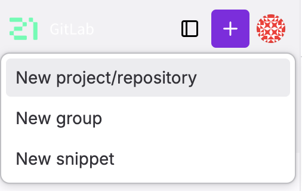
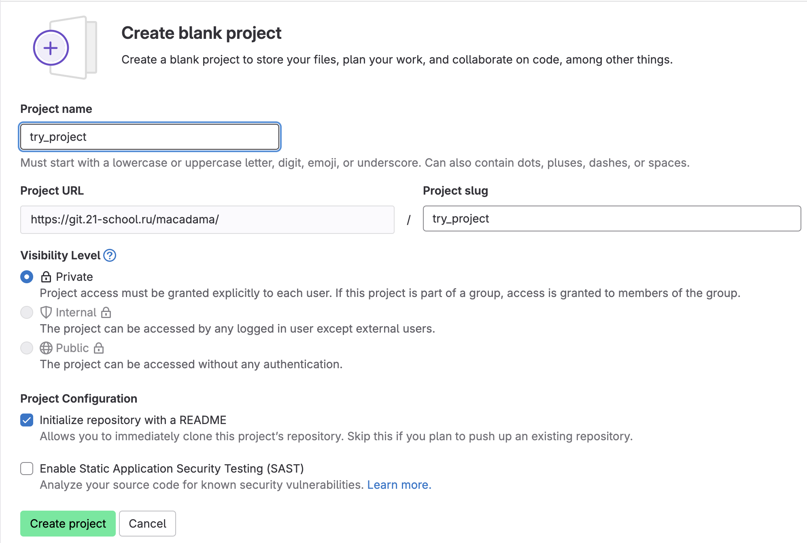
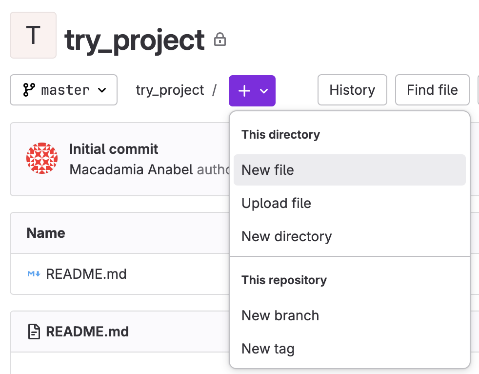
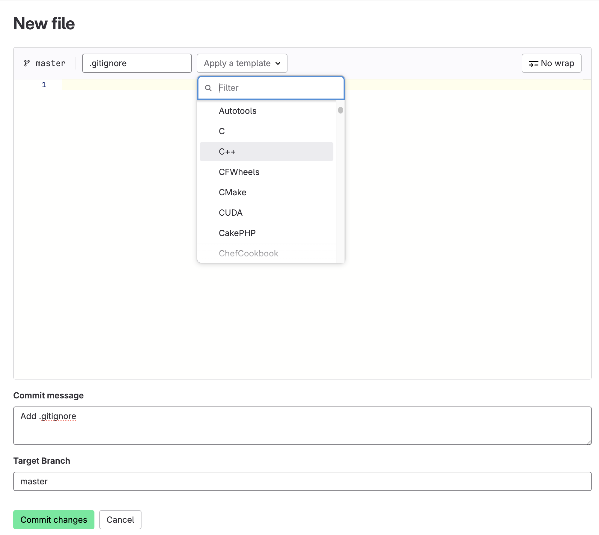
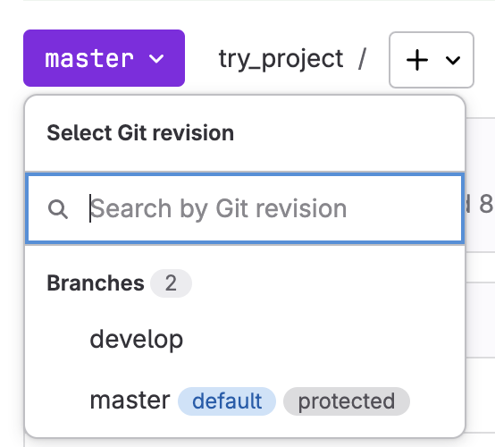
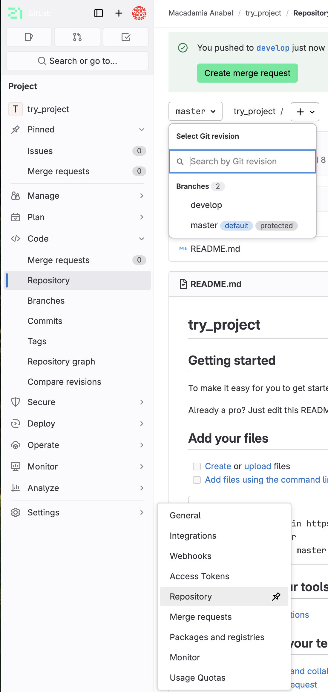
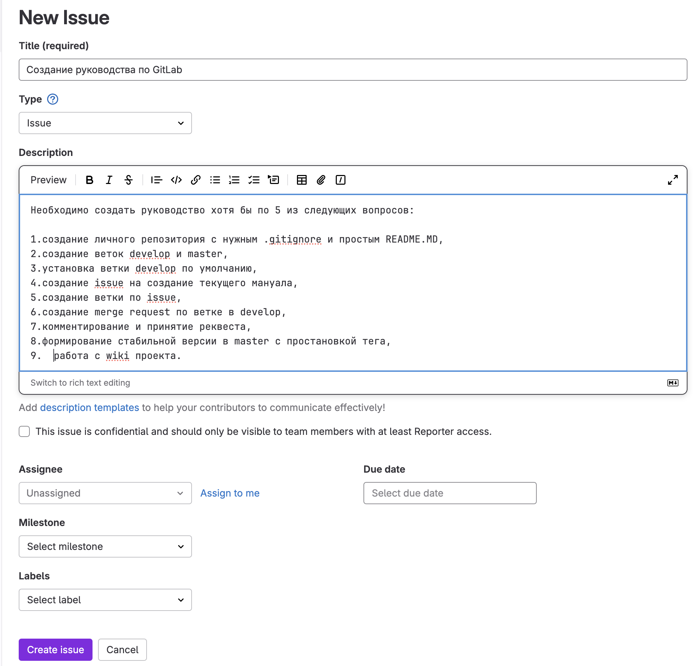
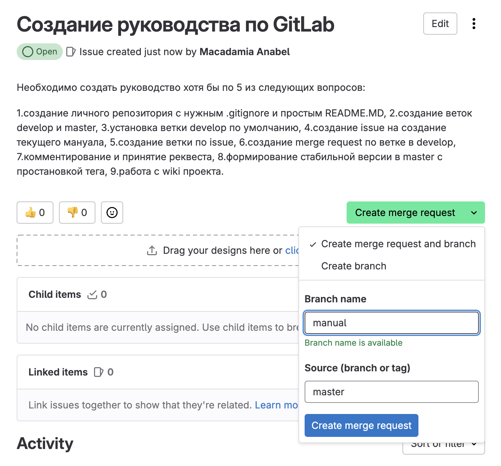

# Руководство по работе с GitLab
## 1. Создание первого репозитория

Итак, сначала нажимаем на кнопку "New Project" и далее выбираем "Create blank project"

Далее заполняем необходимые поля: название прокета, его доступность и ставим галочку, чтобы первый README создался автоматически.

Далее добавим первый .gitignore. Для этого нажмём на плюсик и выберем New File

Впишем в появившееся поле .gitignore и выберем в списке язык, на котором планируем пограммировать.

Готово! Первый репозиторий создан.

## 2. Создание веток
Для создания новой ветки так же стоит в репозитории нажать на плюсик и в выпавшем списке нажать New Branch. Вписать в открывшемся окне название новой ветки и от какой ветки она будет ответвляться.

Теперь если нажать на master, можно выбрать ветку, которая сейчас необходима.

## 3. Установка ветки по умолчанию
Для того чтобы не портить основную ветку, необходимо работать в, как ни странно, рабочей ветке develop. Мы её уже создали, теперь для простоты можно установить эту ветку по умолчанию. Чтобы это сделать найдём в левой панели слово setting и выберем там Repositories.

Теперь останется лишь найти раздел Branch defaults, поменять там основную ветку master на develop и сохранить изменения.

## 4. Создание issue на создание текущего мануала
Для создания задачи нужно перейти в issue слева и нажать New Issue. В открывшемся окне нужно заполнить заголовок и описание задачи, а так же можно выбрать интересующие параметры.

## 4. Создание ветки по issue
Переходим на страницу интересующей нас задачи. Выбираем там Create merge request and branch. Там в выпавшем окошке заполняем всёб что нам необходимо: название новой ветки, в какую ветку хотим её потом слить, пишем коментарийб если нужно.

## Конец
GitLab не так уж и страшен.